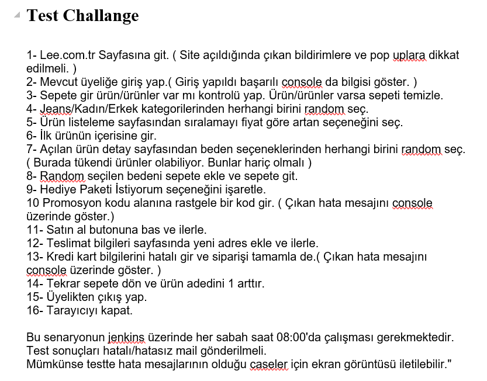
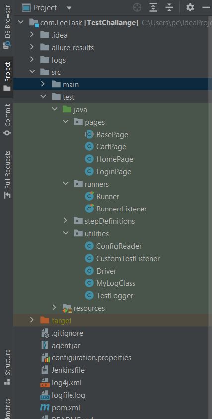
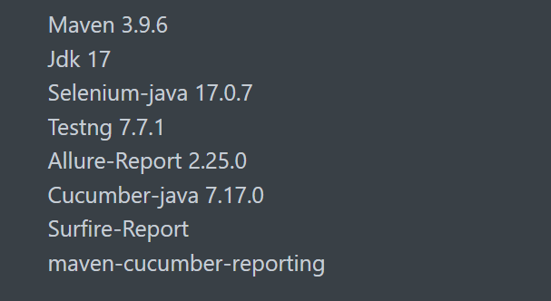
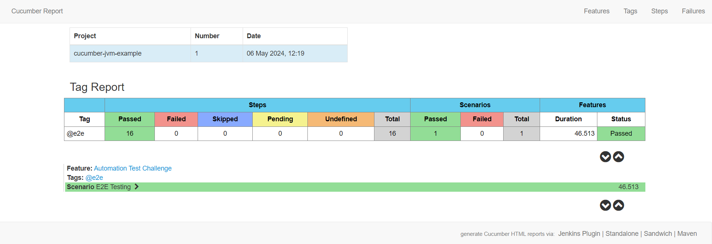
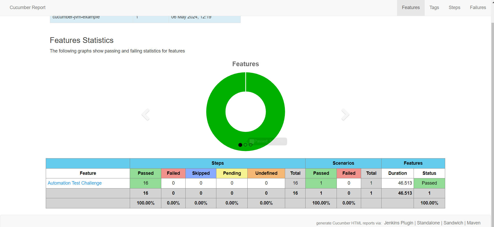
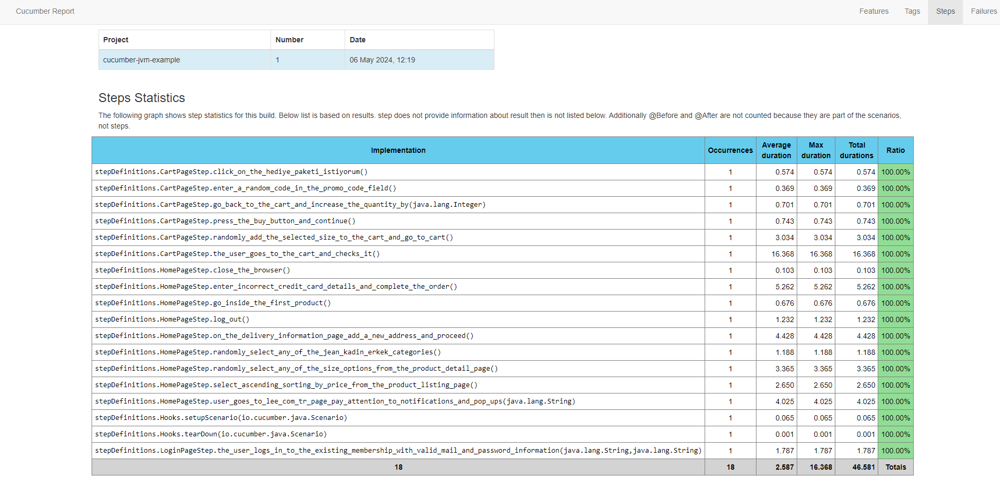
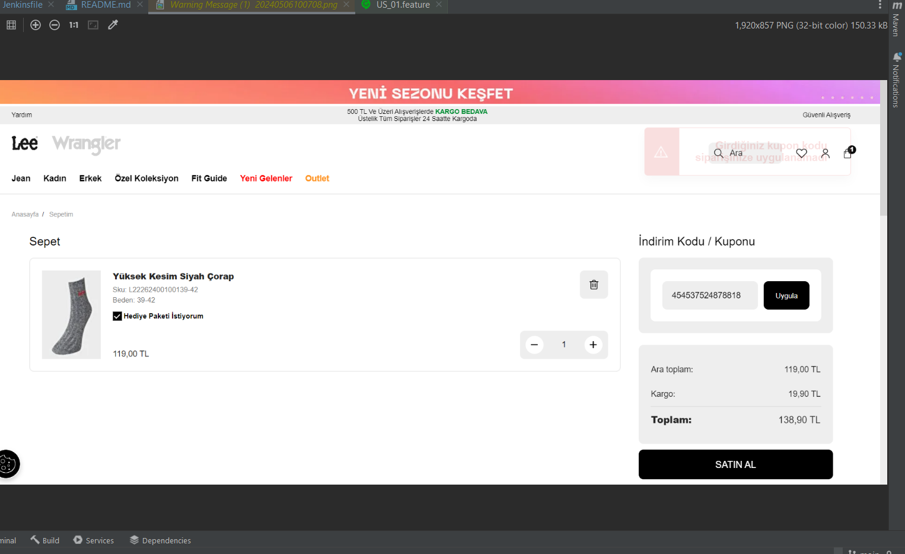
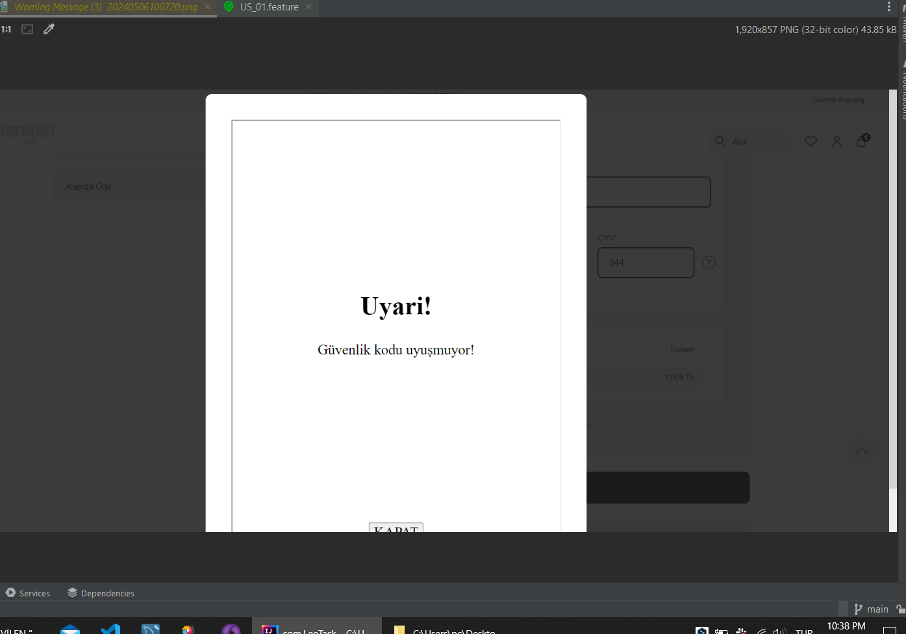

# Bdd Ui Test Automation Framework with POM Design For Beginners.

Java Selenium Automation Test With Gherkin Syntax - TestListener - Log4j - Jenkins Integration

# Test Purpose
Test automation is to complete a number of tasks requested by aiming to use many test methods that can be used in a web automation project. With automation, it is aimed to test the visibility, clickability and activation of many functions on the web page with various methods, taking screenshots of the desired errors, traceability of the tests, keeping log records and automating them with jenkins.

# Project Solution
The properties folder contains tests. They are coded with Gherkin syntax. Background steps run before the test and make the test executable.

The StepDefinitions directory contains the methods of the steps written in the properties files. The BaseStep class is designed to create a PageObject. Also, the Hooks class contains various commands at the beginning and end of the scenario, depending on the success-failure status.

The Runner directory contains classes that trigger tests in automation. Optionally, Runners running with JUnit optimization or TestNG optimization can be used.

Utilities directory; Drivers directory contains the creation of the driver and passing it to other classes. It also contains various driver and window settings.
The ConfigReader class loads and accesses the configuration settings from the configuration.properties file to manage the configuration settings used in the project and to read these settings easily.
CustomTestListener for TestNG and TestLogger for JUnit monitor the tests in the automation for JUnit according to success, failure or various desired conditions and keep the necessary records and reports in cooperation with MyLogClass.

# Framework  Installation  / Libraries / Tech Stack

* "mvn clean verify" will be enough
* This project is installed on "windows 10", version: "10.0", arch: "amd64". You should update the drivers for your own operating system.

# Sample Report

